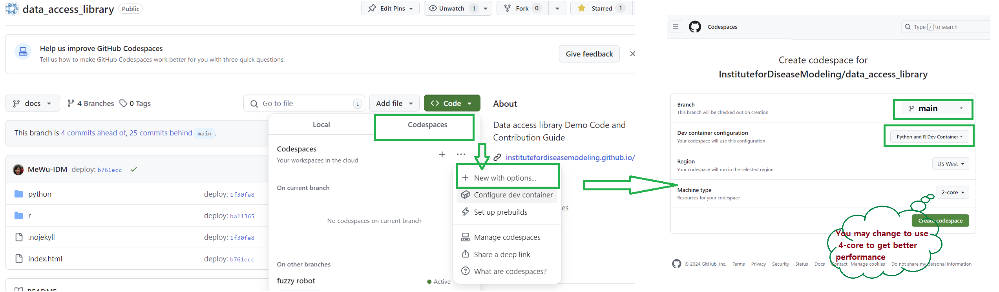
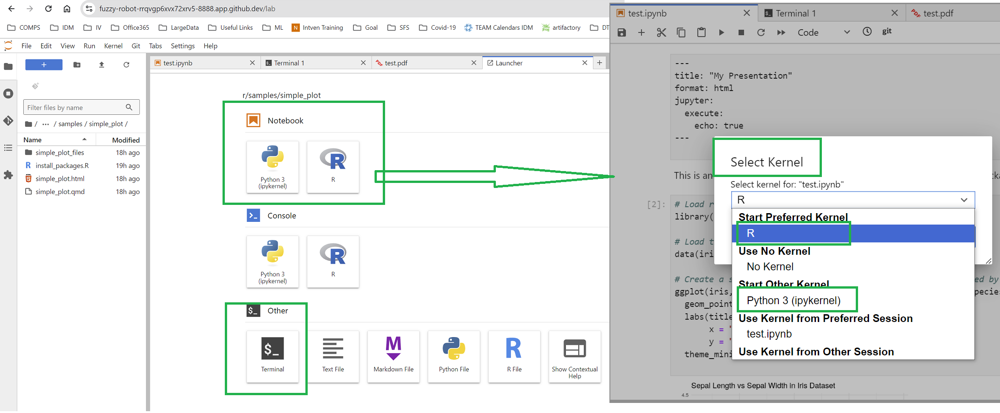
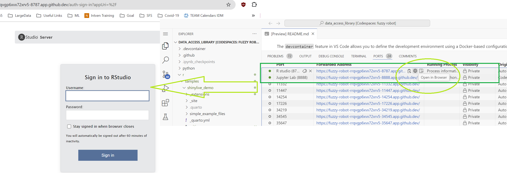

# Data Access and Analysis Library Demo

This repository demonstrates some good examples for sharing interactive, reproducible data analysis code across Python and R.
By leveraging devcontainer for consistent development environments and Quarto for technical publishing, 
this setup ensures a smooth experience for researchers to share their code and ideas.

Contributors are encouraged to submit code examples using Quarto in `r/samples` or `python/samples` folders. 
Our goal is not to provide a comprehensive guide to showcase the possibilities of using Quarto for technical publishing. 
But by adding yaml metadata to your codesnippets, it allows publishing the content to Github Pages easily and
others can view the code / results directly in the browser without running the code. 

## 1. Use of Devcontainer

The `devcontainer` feature in VS Code allows you to define the development environment using a Docker-based configuration. 
This ensures that all participant in a project has a consistent setup, eliminating the "works only on my machine" problem. 
By using `devcontainer.json`, you can specify the required dependencies for Python and R, configure the environment, 
and set up additional tools like Jupyter and Quarto for sharing your work.

**How to:**

In this repo, we have a template "Python and R Dev Container" that you can use to create a consistent development environment. 
Go to github codespaces and create a new codespace using this template as shown below: 
**(This may take 5-10 minutes, and please be aware of codespace [costs](https://docs.github.com/en/billing/managing-billing-for-your-products/managing-billing-for-github-codespaces/about-billing-for-github-codespaces#monthly-included-storage-and-core-hours-for-personal-accounts) )**



If you choose to clone the repo locally, you can also setup your local container to use the same environment, 
follow this [tutorial](https://code.visualstudio.com/docs/devcontainers/tutorial) to set it up.

If your project requires additional dependencies, you can create a customized `your_devcontainer.json` file. 
For more information, check the [VS Code documentation](https://code.visualstudio.com/docs/remote/containers). 
There are many features available in the devcontainer that you can leverage, see this [list](https://containers.dev/features).


## 2. Quarto Examples Using Jupyter Notebook

Quarto is an open-source tool for technical publishing that enables you to create interactive, data-driven documents. 
It is built on top of the R Markdown format and supports Jupyter notebooks as part of its ecosystem.
This section provides examples of using Quarto with Jupyter notebooks for Python-based data analysis. 
The integration allows you to create rich, interactive documents that blend code, analysis, and markdown. for more information, go to [Quarto.org](https://quarto.org/).

**How to:**

In this repo, we have a sample Jupyter notebook [sir_model_simulation.ipynb](python/samples/sir/sir_model_simulation.ipynb) 
that demonstrates how you can insert a yaml at the top of a markdown cell to specify metadata for quarto publishing.
If you are using codespace, a jupyterlab instance is running on port 8888, and you can edit the notebook in the browser or add your own:



It is a good practice to add required dependencies in the [requirements.txt](python/samples/sir/requirements.txt) file 
so that your example will be easily reproducible by others. You can also choose to use the magic command `!` or `%` 
inside your notebook to install dependent packages.

```python
!pip install numpy~=2.1
%pip install matplotlib>=3.9
```

## 3. Quarto Examples Using `.qmd` for R

In this section, we explore how to use Quarto's `.qmd` format to create reproducible reports in R. 
Quarto simplifies the process of creating technical documents that include R code, plots, and analysis. 
The `.qmd` files serve as an efficient way to write and maintain both the narrative and the underlying code used in your analysis.
It is very similar to R Markdown but offers additional features and flexibility for publishing.

**How to:**

In this repo, we have a sample Quarto document [simple_plot.qmd](r/samples/simple_plot/simple_plot.qmd) that shows how to add metadata and use R code chunks.
If you are using codespace, an Rstudio Server instance is running on port 8787 (username: **rstudio**, password: **rstudio**)
and you can edit the `.qmd` file directly in the browser or add your own:



You should handle `install.packages` and `library` commands to install and load the required R packages for reproducibility, or provide 
a [install_packages.R](r/samples/simple_plot/install_packages.R) file so that others can reproduce your code easily.


## 4. Key Quarto commands

You can open a terminal window in the codespace and run the following commands to build the quarto document, for example:

```bash
quarto render your_example.qmd
quarto render your_example.ipynb --to html
```
Quarto allows you to customize the rendering of documents using both the `quarto render` command and the YAML header within a file. Here's a brief overview:

### Quarto Render Command Options:
- **Output Format:** You can specify the format (HTML, PDF, DOCX, etc.) by adding the `--to` flag. For example:
  ```bash
  quarto render file.qmd --to pdf
  ```
  This converts your `.qmd` or `.ipynb` file to PDF.

- **Output Directory:** Control where the output file is saved using `--output-dir`:
  ```bash
  quarto render file.qmd --output-dir output/
  ```

### YAML Header Options:
- **Document Metadata:** Set properties like title, author, and date in the YAML header:
  ```yaml
  ---
  title: "My Report"
  author: "Jane Doe"
  ---
  ```

- **Table of Contents (TOC):** Enable and position the table of contents:
  ```yaml
  ---
  toc: true
  toc-location: left
  ---
  ```

- **Code Execution:** Control whether code is executed or shown in the final document:
  ```yaml
  ---
  execute:
    echo: true
  ---
  ```

These options give you flexibility to control how your documents are rendered, either through the command line or the YAML configuration in your file.


## 5. Github Page hosting
All examples checked in to this repo under `r/samples` or `python/samples` 
will be published to [Github Pages](https://institutefordiseasemodeling.github.io/data_access_library/). automatically when merged to main branch.

